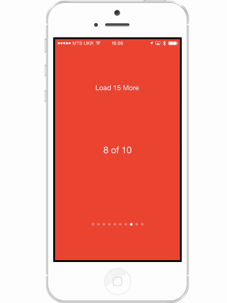

# DAPageControlView

## Abstract

I just love `UIPageControl`, don’t you? It’s simple and intuitive, it does not get any more "native" than this since Apple has used it in SpringBoard for ages. UIPageControl is the perfect choice when you have a fullscreen `UIScrollView` (`UICollectionView`) with `pagingEnabled` and you want to encourage your users to “swipe to see more”.

`DAPageControlView` gives your users the exact same experience they get from `UIPageControl`, and something more. While `UIPageControl` is a winner for static data, `DAPageControlView` might be a better choice for the case when you fetch your data from a server in chunks and/or do not know the total number of items.

Check out this gif with a `UICollectionView` of `PictureViews`: at first it displays just 5 of them and as soon as the user reaches the 4th one, it requests the next chunk of pictures and displays them shortly after that.  

  

Note, that after fetching the second "portion" of pictures, if we used `UIPageControl`, the dots would not fit the screen width, but `DAPageControlView` is scrollable and applies "perspective" effect to dots on the right and/or on the left if neccessary. If all the dots can fit the screen `DAPageControlView` behaves exactly like `UIPageControl`.  
Also there is an option to make the rightmost dot "blink" to let the user know that more items are loading.

## Installation

DAPageControlView is available through [CocoaPods](http://cocoapods.org). To install
it, simply add the following line to your Podfile:

    pod "DAPageControlView"

## Usage

To run the example project, clone the repo, and run `pod install` from the Example directory first.  

`DAPageControlView` is just a `UICollectionView` that depending on the `contentOffset` of a `UIScrollView` it is binded with, automatically updates its `currentPage` and, if neccessary, resizes its rightmost or leftmost page indicator views (dots) if there are more pages to the right or to the left accordingly.  

First you create your `DAPageControlView` just like you would create a `UIPageView`

    self.pageControlView = [[DAPageControlView alloc] initWithFrame:CGRectMake(0., 0., 320., 15.)];
    self.pageControlView.numberOfPages = self.pagesCount;
    self.pageControlView.currentPage = 0;
    [self.view addSubview self.pageControlView];

And of course you need a `UIScrollView` to bind it with. I have a `UICollectionView` as I want to reuse its subviews:

    self.collectionView = [[UICollectionView alloc] initWithFrame:self.view.bounds collectionViewLayout:layout];
    self.collectionView.showsHorizontalScrollIndicator = NO;
    self.collectionView.pagingEnabled = YES;
    self.collectionView.dataSource = self;

Now we need to let our `pageControlView` know about the `contentOffset` of the `collectionView`. The easiest way is to do this in `scrollViewDidScroll:` (`UIScrollViewDelegate` method) 

    - (void)scrollViewDidScroll:(UIScrollView *)scrollView
    {
        [self.pageControlView updateForScrollViewContentOffset:self.collectionView.contentOffset.x];
    }

There is a `DAPageControlViewDelegate` if you want to be notified when a currentPage property is changed (page indicator views can be selectable). Also there is a `numberOfPagesAllowingPerspective` to configure precisely that.

## License

DAPageControlView is available under the MIT license. See the LICENSE file for more info.

